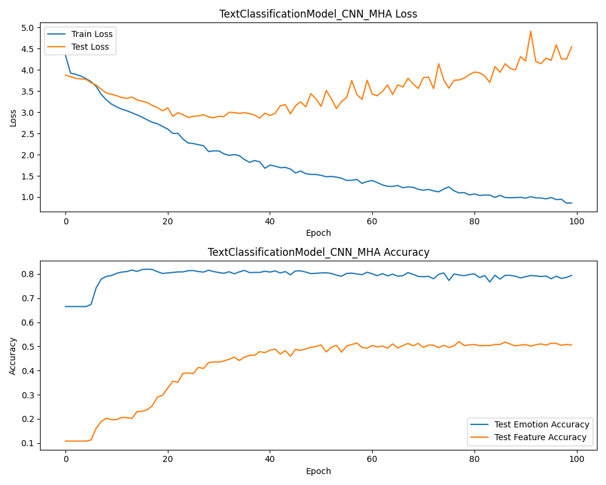

# 几种主流模型在商品金融短文本精细化分类上的表现

写在前面：这是一个存档。并且我承认这些模型都很古典/ww

运行环境：cuda:12 on RTX3090

## 1.数据集

这个项目并没有使用公共数据集，数据集的内容主要是微博上李佳琦带货的商品评价区的评价。

**下面是一些数据的示例**

| 文本                                                         | 分类       | 情感     | 编号 |
| ------------------------------------------------------------ | ---------- | -------- | ---- |
| 李佳琦争气很好很优秀，衣服也更符合大家的眼光。               | 主播品质   | positive | 1    |
| 说什么比李佳琦好，李佳琦直播间时尚沙漠，李佳琦老头眼光。     | 选品       | positive | 2    |
| 人家都说了，李佳琦直播间没办法上网红店衣服，只能选质量好一点的舒服的。 | 服饰类质量 | positive | 3    |
| 李佳琦直播间的产品选品就这？                                 | 选品       | negative | 4    |
| 咱好歹是钻粉5，买的东西也不少，太失望了，品控太差了          | 选品       | negative | 5    |
| 李佳琦直播间现在选品是真的有问题啊，以前生活品都闭眼买质量绝对没问题、现在真的是. | 选品       | negative | 6    |
| 他怎么能做到闭眼吹这个品好的？？                             | 主播信任度 | negative | 7    |
| 我之前真的是随便点进去就选几样现在这种信任渐渐崩塌了我已经开始害怕 | 主播信任度 | negative | 8    |

**下面目标类别**

| 类簇   | 类                                                           |
| ------ | ------------------------------------------------------------ |
| 主播   | 主播专业度、主播信任度、主播支持度、主播语速、主播品质、主播责任感、主播话术、主播公益事业 |
| 价格   | 优惠、促销活动、福利、折扣、性价比、赠品、红包、满减活动、赠品、积分兑换 |
| 直播间 | 直播间氛围、直播间预告、直播设备、直播间画质                 |
| 物流   | 快递、发货、包装                                             |
| 售后   | 服务态度、客服、退款、退货                                   |
| 选品   | 美妆类质量、日用品质量、生活用品质量、母婴品质量、电器质量、食品质量、饮品质量、服饰类质量、饰品质量、家具质量 |
| 系统   | 系统定价、系统问题、链接数量                                 |

总体而言类别很多。同时还进行情感分类。

## 2.模型结构

### 2.1word2vec

如果有人想在本地再跑一遍我的代码的话（应该没有）除了需要配置一下cuda和那些python库还需要下面的预训练的word2vec

[GitHub - Embedding/Chinese-Word-Vectors: 100+ Chinese Word Vectors 上百种预训练中文词向量](https://github.com/Embedding/Chinese-Word-Vectors)

使用了他们提供的 微博专门 预训练word2vec模型（也就是[SGNS的weibo的Word + Character + Ngram](https://pan.baidu.com/s/1FHl_bQkYucvVk-j2KG4dxA)）

### 2.2 模型结构

#### TextClassificationModel_CNN_MHA

| 参数             | 值                              |
| ---------------- | ------------------------------- |
| 模型名称         | TextClassificationModel_CNN_MHA |
| 嵌入维度         | 300                             |
| 卷积核大小       | 3                               |
| 卷积层滤波器数量 | 64                              |
| 注意力头数       | 8                               |
| 输出情感类别数量 | 2                               |
| 输出特征类别数量 | 10                              |
| 使用预训练嵌入   | 是                              |

该模型包括一个嵌入层、卷积层、多头自注意力层和多个全连接层，用于同时处理文本序列和特征序列。它具有多个输出，用于情感分类和特征分类。

#### TextClassificationModel_BiLSTM_CNN_MHA

| 参数             | 值                                     |
| ---------------- | -------------------------------------- |
| 模型名称         | TextClassificationModel_BiLSTM_CNN_MHA |
| 嵌入维度         | 300                                    |
| LSTM隐藏维度     | 128                                    |
| 卷积核大小       | 3                                      |
| 卷积层滤波器数量 | 64                                     |
| 注意力头数       | 8                                      |
| 输出情感类别数量 | 2                                      |
| 输出特征类别数量 | 10                                     |
| 使用预训练嵌入   | 是                                     |

该模型包括一个嵌入层、双向LSTM层、卷积层、多头自注意力层和多个全连接层，用于同时处理文本序列和特征序列。它具有多个输出，用于情感分类和特征分类。

#### TextClassificationModel_BiGRU

| 参数             | 值                            |
| ---------------- | ----------------------------- |
| 模型名称         | TextClassificationModel_BiGRU |
| 嵌入维度         | 300                           |
| GRU隐藏维度      | 32                            |
| 注意力头数       | 8                             |
| 输出情感类别数量 | 2                             |
| 输出特征类别数量 | 10                            |
| 使用预训练嵌入   | 是                            |

该模型包括一个嵌入层、双向GRU层和多头自注意力层，用于同时处理文本序列和特征序列。它具有多个输出，用于情感分类和特征分类。

#### TextClassificationModel_BiLSTM_MHA

| 参数             | 值                                 |
| ---------------- | ---------------------------------- |
| 模型名称         | TextClassificationModel_BiLSTM_MHA |
| 嵌入维度         | 300                                |
| LSTM隐藏维度     | 128                                |
| 注意力头数       | 8                                  |
| 输出情感类别数量 | 2                                  |
| 输出特征类别数量 | 10                                 |
| 使用预训练嵌入   | 是                                 |

该模型包括一个嵌入层、双向LSTM层、多头自注意力层和多个全连接层，用于同时处理文本序列和特征序列。它具有多个输出，用于情感分类和特征分类。

#### TextClassificationModel_GRU_MHA

| 参数             | 值                              |
| ---------------- | ------------------------------- |
| 模型名称         | TextClassificationModel_GRU_MHA |
| 嵌入维度         | 300                             |
| GRU隐藏维度      | 128                             |
| 注意力头数       | 8                               |
| 输出情感类别数量 | 2                               |
| 输出特征类别数量 | 10                              |
| 使用预训练嵌入   | 是                              |

该模型包括一个嵌入层、GRU层、多头自注意力层和多个全连接层，用于同时处理文本序列和特征序列。它具有多个输出，用于情感分类和特征分类。

#### TextClassificationModel_BiGRU_MHA

| 参数             | 值                                |
| ---------------- | --------------------------------- |
| 模型名称         | TextClassificationModel_BiGRU_MHA |
| 嵌入维度         | 300                               |
| GRU隐藏维度      | 128                               |
| 注意力头数       | 8                                 |
| 输出情感类别数量 | 2                                 |
| 输出特征类别数量 | 10                                |
| 使用预训练嵌入   | 是                                |

该模型包括一个嵌入层、双向GRU层、多头自注意力层和多个全连接层，用于同时处理文本序列和特征序列。它具有多个输出，用于情感分类和特征分类。

## 3.模型成绩

注意，事实上Emotion和Feature是一起进行预测的。这里为了方便单独展示。但一般情况下。Emotion准确率高的情况下Feature准确率也会很高。

### 3.1最高Emotion准确率

| 模型名称                               | 最高Emotion成绩 |
| -------------------------------------- | --------------- |
| TextClassificationModel_CNN_MHA        | 0.8297          |
| TextClassificationModel_BiLSTM_CNN_MHA | 0.8233          |
| TextClassificationModel_BiGRU          | 0.8396          |
| TextClassificationModel_BiLSTM_MHA     | 0.8219          |
| TextClassificationModel_GRU_MHA        | 0.8233          |
| TextClassificationModel_BiGRU_MHA      | 0.819           |

### 3.2最高Feature准确率

| 模型名称                               | 最高Feature成绩 |
| -------------------------------------- | --------------- |
| TextClassificationModel_CNN_MHA        | 0.5564          |
| TextClassificationModel_BiLSTM_CNN_MHA | 0.726           |
| TextClassificationModel_BiGRU          | 0.7991          |
| TextClassificationModel_BiLSTM_MHA     | 0.7402          |
| TextClassificationModel_GRU_MHA        | 0.6962          |
| TextClassificationModel_BiGRU_MHA      | 0.9759          |

### 3.3训练情况

## 4.总结

发现这几个主流模型的成绩都非常可观。有些超出预期。特别是在应对细致化分类和同时进行文本特征分类和情感分类两个任务的时候表现优异。当然，单独把情感特征分类拿出来是因为它是唯一的一个二分类，并且难度相对较大。

我猜测模型表现优异的原因有部分来自数据集和使用了专门的预训练word2vec模型。